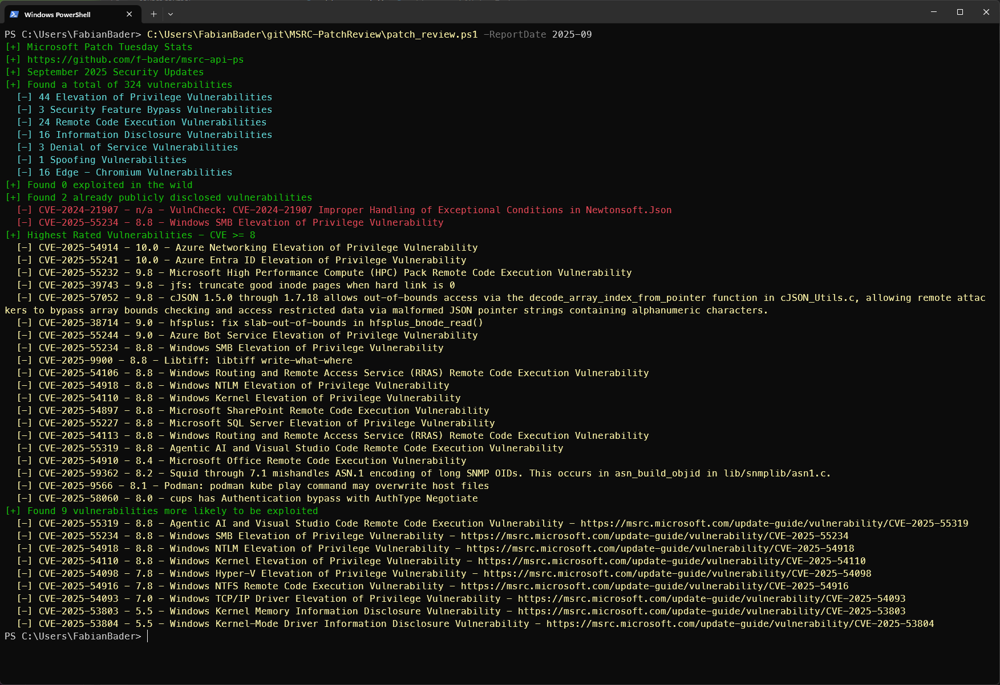

# MSRC-PatchReview

A PowerShell variant of the amazing patch_review.py by [kevthehermit](https://github.com/Immersive-Labs-Sec/msrc-api)



## Usage

To get a report for the current month, just run the script without any additional parameters

```bash
$ .\patch_review.ps1
```

If you want to define the reporting month use YYYY-MMM (2025-Mar) or YYYY-MM (2025-03) format

```bash
$ .\patch_review.ps1 2025-05
```

### Change output format

Default is **human-readable** which writes output similar to the original Python script. For programmatic use, select **json** or **psobject**. Markdown output is also available.

```bash
$ .\patch_review.ps1 2025-05 -Output json
```

```bash
$ .\patch_review.ps1 2025-05 -Output psobject
```

```bash
$ .\patch_review.ps1 2025-05 -Output markdown
```

### Change CVE Url

By default the **MSRC** Url is used for the links but you can change it to **CVE.org** if you like.

```bash
$ .\patch_review.ps1 2025-05 -CVELink CVE.org
```

Use `-CVELink None` to omit links from both human-readable and Markdown output.

### Change CVE BaseScore

The highest rated CVEs are by default all CVEs above **8.0**. This can be changed easily to fit your needs.

```bash
$ .\patch_review.ps1 2025-05 -BaseScore 9
```

## Tests

Run the offline end-to-end regression suite:

```powershell
Invoke-Pester -Path ./tests/patch_review.Tests.ps1
```

Run static analysis with the repository settings (the colorized console renderer intentionally uses `Write-Host`):

```powershell
Invoke-ScriptAnalyzer -Path ./patch_review.ps1 -Settings ./PSScriptAnalyzerSettings.psd1
```
