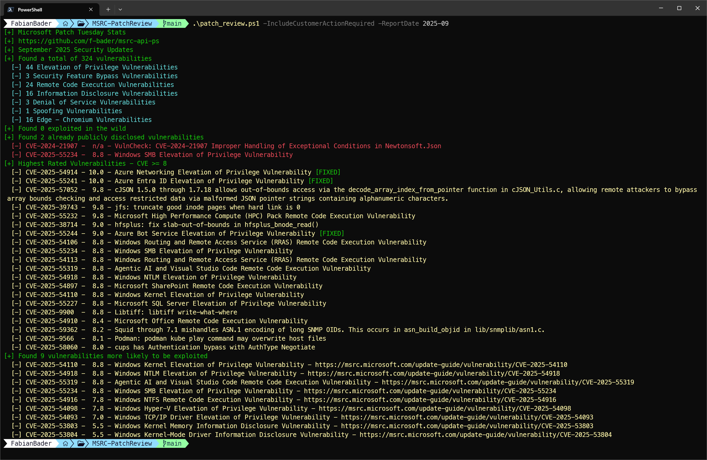

# MSRC-PatchReview

A PowerShell variant of the amazing patch_review.py by [kevthehermit](https://github.com/Immersive-Labs-Sec/msrc-api)



## Usage

To get a report for the current month, just run the script without any additional parameters

```bash
$ .\patch_review.ps1
```

If you want to define the reporting month use YYYY-MMM (2025-Mar) or YYYY-MM (2025-03) format

```bash
$ .\patch_review.ps1 2025-05
```

### Change output format

Default is **human-readable** which will write the output similat to the original python script to stdout. But if you would like to use the data in any way after the script is run you can use either **json** or **psobject**.

```bash
$ .\patch_review.ps1 2025-05 -Output json
```

```bash
$ .\patch_review.ps1 2025-05 -Output psobject
```

### Change CVE Url

By default the **MSRC** Url is used for the links but you can change it to **CVE.org** if you like.

```bash
$ .\patch_review.ps1 2025-05 -CVELink CVE.org
```

### Change CVE BaseScore

The highest rated CVEs are by default all CVEs above **8.0**. This can be changed easily to fit your needs.

```bash
$ .\patch_review.ps1 2025-05 -BaseScore 9
```
